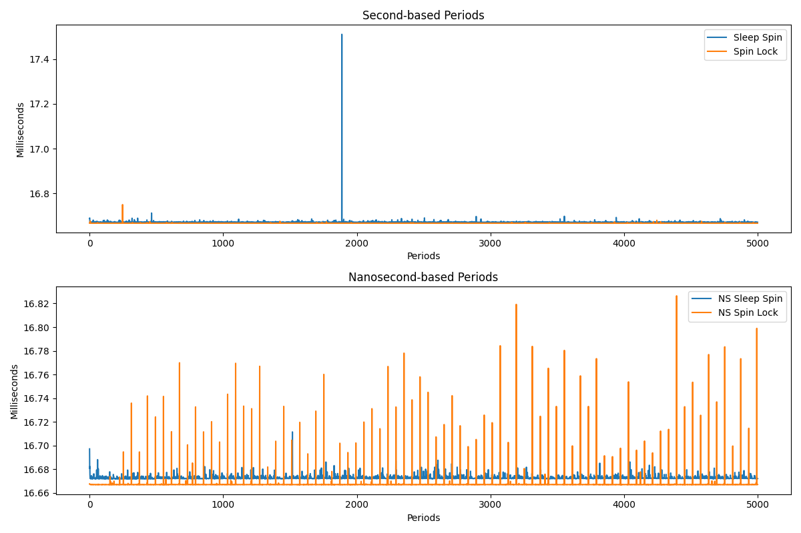

# Period Duration over Time

## macOS Results

132Hz, No Load

132Hz, Under Load

60Hz, No Load

60Hz, Under Load

## Raspberry Pi Results

132Hz, No Load

132Hz, Under Load

60Hz, No Load

60Hz, Under Load

## Windows Results

132Hz, No Load

132Hz, Under Load

60Hz, No Load

60Hz, Under Load

## Linux VM on macOS Results

132Hz, No Load

132Hz, Under Load

60Hz, No Load

60Hz, Under Load

## Linux VM on Windows Results

132Hz, No Load

132Hz, Under Load

60Hz, No Load

60Hz, Under Load

